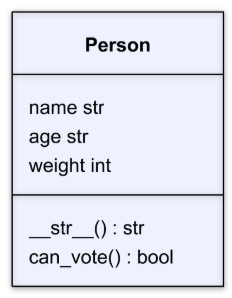

# COMPS III: Assignment #1 - `Person` Class

## Instructions
**TASK:** In this assignment, you will dive into object oriented programming in Python by creating a `Person` class, defining its attributes and methods, and then using this class to create objects. The `Person` class you need to build has the following class diagram:

Your `Person` class should have the following attributes and methods:
- **Attributes**
    - `name (str)`: A string that contains the individual’s name.
    - `age (int)`:  An integer containing the individual’s age.
    - `country (str)`: A string containing the individual’s country.
- **Methods**
    - `__str__()`: This method should return a string with the object's information in the format: `“NAME is AGE years old and is from COUNTRY.”`
    - `can_vote()`: This method should take an object and return `True` if the person can vote (i.e. they are 18 years of age or older) and return `False` if they are not old enough to vote.

## Unit Tests
These unit tests work by testing two person instances with the following values.
- Person 1
    - **Name**: "John"
    - **Age**: 17
    - **Country**: "Canada"
- Person 2
    - **Name**: "Maria"
    - **Age**: 25
    - **Country**: "Spain"

### Unit Test Explanations
- `test_can_create_person_1`: Tests that a `Person` object can be created with the values of "John", 17, and "Canada".
- `test_can_create_person_2`: Tests that a `Person` object can be created with the values of "Maria", 25, and "Spain".
- `test_person_1_string`: Tests that a `Person` object with the values of "John", 17, and "Canada" has a `str` method that prints `"John is 17 years old and is from Canada."`
- `test_person_2_string`: Tests that a `Person` object with the values of "Maria", 25, and "Spain" has a `str` method that prints `"Maria is 25 years old and is from Spain."`
- `test_person_1_cannot_vote`: Tests that a person with values of "John", 17, and "Canada" returns `False` when `can_vote` is invoked.
- `test_person_2_can_vote`: Tests that a person with values of "Maria", 25, and "Spain" returns `True` when `can_vote` is invoked.